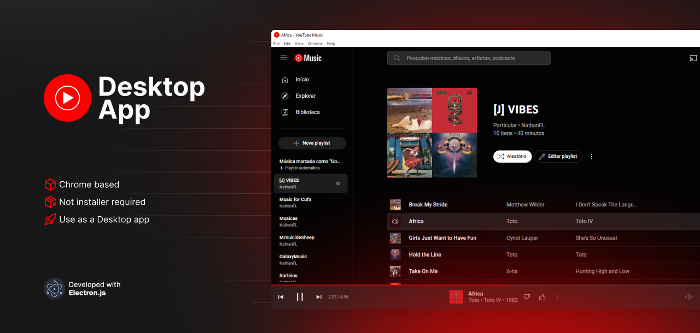

Until now it was not possible to download any official YouTube desktop app to use Youtube Music through a dedicated desktop app like spotify, so I ended up creating this app in electron for personal use
<br></br>

# 📦 Using the build:

[Download the latest version from Releases](https://github.com/nathanflbr/youtube-desktop-app/releases), extract the files to your desktop or preferred location and run the youtube-desktop-app.exe file
<br></br>

# 💻 Initializing the project

### 🔧 Clone the project:

```bash
git clone https://github.com/nathanflbr/youtube-desktop-app
```

### 📚 Install the dependencies with:

```bash
npm instal
```

### 🚧 Application startup with:

```bash
npm start
```

### ⚡ For build:

```bash
npm run make
```
